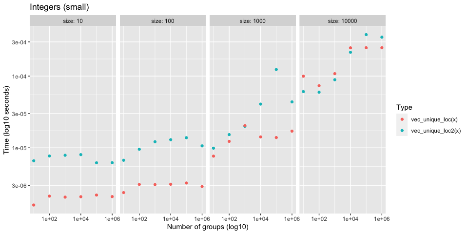

Sorting vs Hashing
================

Investigates performance of `vec_order()` vs current implementation of
`vec_unique()`, which is based on hashing and a dictionary. It might be
worth switching to use the sort based approach of `vec_order()`.

## Setup

``` r
# load dev vctrs
devtools::load_all()

library(rlang)
library(stringr)
library(ggplot2)
library(dplyr)
```

``` r
# Generate `size` random words of varying string sizes
new_dictionary <- function(size, min_length, max_length) {
  lengths <- rlang::seq2(min_length, max_length)

  stringi::stri_rand_strings(
    size,
    sample(lengths, size = size, replace = TRUE)
  )
}
```

``` r
# Work around bench_expr bug where vectorized attribute isn't being sliced
# https://github.com/r-lib/bench/pull/90

filter_bench <- function(.data, ...) {
  out <- dplyr::mutate(.data, rn = row_number()) %>%
    dplyr::filter(...)
  
  # patch up bench_expr
  which <- out$rn
  desc <- attr(.data$expression, "description")
  attr(out$expression, "description") <- desc[which]
  
  out$rn <- NULL
  
  out
}
```

``` r
plot_bench <- function(df, title = waiver()) {
  df %>%
    ggplot(aes(x = n_groups, y = as.numeric(median))) +
    geom_point(aes(color = as.character(expression))) +
    facet_wrap(~ size, labeller = label_both, nrow = 1) +
    scale_x_log10() +
    scale_y_log10() + 
    labs(
      x = "Number of groups (log10)",
      y = "Time (log10 seconds)",
      color = "Type",
      title = title
    )
}
```

## Compare with `vec_unique_loc()`

It is worth comparing to `vec_unique_loc()`, which is the most bare
bones of the uniqueness functions, to test whether or not
uniqueness-by-sorting can be faster than uniqueness-by-hashing.

## Integers

### Test 1

  - Integers
  - Varying total size (small)
  - Varying group size

<!-- end list -->

``` r
set.seed(123)

size <- 10 ^ (1:4)
n_groups <- 10 ^ (1:6)

df <- bench::press(
  size = size,
  n_groups = n_groups,
  {
    x <- sample(n_groups, size, replace = TRUE)
    bench::mark(
      vec_unique_loc2(x), vec_unique_loc(x), 
      iterations = 100, check = FALSE
    )
  }
)
```

Performance is generally the same for small sizes

<!-- -->

However, `size = 10000` seems to already show `vec_unique_loc2()` being
faster.

``` r
df %>% filter(size == 10000)
#>  # A tibble: 12 x 8
#>     expression          size n_groups     min  median `itr/sec` mem_alloc
#>     <bch:expr>         <dbl>    <dbl> <bch:t> <bch:t>     <dbl> <bch:byt>
#>   1 vec_unique_loc2(x) 10000       10  40.8µs  60.7µs    16465.     469KB
#>   2 vec_unique_loc(x)  10000       10  60.8µs 103.5µs     9624.     104KB
#>   3 vec_unique_loc2(x) 10000      100  38.9µs  55.6µs    18950.     470KB
#>   4 vec_unique_loc(x)  10000      100  61.3µs    99µs    10194.     105KB
#>   5 vec_unique_loc2(x) 10000     1000  69.9µs  80.8µs    12241.     434KB
#>   6 vec_unique_loc(x)  10000     1000  75.7µs 115.6µs     8891.     114KB
#>   7 vec_unique_loc2(x) 10000    10000 176.6µs 199.3µs     4884.     455KB
#>   8 vec_unique_loc(x)  10000    10000 177.7µs   216µs     4602.     191KB
#>   9 vec_unique_loc2(x) 10000   100000 356.7µs 424.3µs     2398.     467KB
#>  10 vec_unique_loc(x)  10000   100000 203.4µs 279.8µs     3512.     268KB
#>  11 vec_unique_loc2(x) 10000  1000000 340.8µs 392.2µs     2550.     604KB
#>  12 vec_unique_loc(x)  10000  1000000 212.3µs 254.5µs     3805.     269KB
#>  # … with 1 more variable: `gc/sec` <dbl>
```

### Test 2

  - Integers
  - Varying total size (large)
  - Varying number of groups

<!-- end list -->

``` r
set.seed(123)

size <- 10 ^ (5:7)
n_groups <- 10 ^ (1:6)

df <- bench::press(
  size = size,
  n_groups = n_groups,
  {
    x <- sample(n_groups, size, replace = TRUE)
    bench::mark(
      vec_unique_loc2(x), vec_unique_loc(x), 
      iterations = 20, check = FALSE
    )
  }
)
```

As the total size increases, `vec_unique_loc2()` starts to do better.

<!-- -->

### Test 3

This benchmark shows how much better `vec_unique_loc2()` scales for
large size and large number of groups. For integers it is always faster,
and scales extremely well.

``` r
set.seed(123)

size <- 10 ^ 8
n_groups <- 10 ^ (1:7)

df <- bench::press(
  size = size,
  n_groups = n_groups,
  {
    x <- sample(n_groups, size, replace = TRUE)
    bench::mark(
      vec_unique_loc2(x), vec_unique_loc(x), 
      iterations = 20, check = FALSE
    )
  }
)
```

<!-- -->

## Doubles

### Test 1

  - Doubles
  - Varying total size (small)
  - Varying group size

<!-- end list -->

``` r
set.seed(123)

size <- 10 ^ (1:4)
n_groups <- 10 ^ (1:6)

df <- bench::press(
  size = size,
  n_groups = n_groups,
  {
    x <- sample(n_groups, size, replace = TRUE) + 0
    bench::mark(
      vec_unique_loc2(x), vec_unique_loc(x), 
      iterations = 100, check = FALSE
    )
  }
)
```

`vec_unique_loc2()` is generally a bit slower for these smaller sizes,
but it scales much better with large sizes and larger number of groups.
See the next test.

<!-- -->

### Test 2

This benchmark shows how much better `vec_unique_loc2()` scales for
large size and large number of groups. For doubles it is slower up
front, but scales much better.

``` r
set.seed(123)

size <- 10 ^ 8
n_groups <- 10 ^ (1:7)

df <- bench::press(
  size = size,
  n_groups = n_groups,
  {
    x <- sample(n_groups, size, replace = TRUE) + 0
    bench::mark(
      vec_unique_loc2(x), vec_unique_loc(x), 
      iterations = 20, check = FALSE
    )
  }
)
```

<!-- -->

## Characters

### Test 1

Currently string ordering is much slower than `vec_unique_loc()`
(especially when most strings are unique) due to all of the allocations
that are required + the fact that it does a radix ordering of unique
strings and then an integer radix ordering after that.

I am confident that the C level part of `vec_unique_loc2()` could gain a
`sort_character = false` option that would do a much faster counting
sort in order-of-first-appearance that utilizes the truelengths in a
different way. It wouldn’t sort strings at all, so should be very fast.
This is what `cgroup()` does in `base::order()`, which is not currently
implemented in `vec_unique_loc2()` because I didn’t have a use for it
until now.
<https://github.com/wch/r-source/blob/8d7ac4699fba640d030703fa010b66bf26054cbd/src/main/radixsort.c#L1051>

Very large set of strings with 10 groups

  - Don’t notice much of a difference between the two here, because
    there aren’t many unique strings.

<!-- end list -->

``` r
set.seed(123)

size <- 1e7
n_groups <- 10

dict <- new_dictionary(n_groups, min_length = 5, max_length = 20)
x <- sample(dict, size, TRUE)

bench::mark(vec_unique_loc2(x), vec_unique_loc(x), iterations = 10, check = FALSE)
#>  # A tibble: 2 x 6
#>    expression              min   median `itr/sec` mem_alloc `gc/sec`
#>    <bch:expr>         <bch:tm> <bch:tm>     <dbl> <bch:byt>    <dbl>
#>  1 vec_unique_loc2(x)  101.2ms    115ms      8.82     125MB    0    
#>  2 vec_unique_loc(x)    85.6ms    122ms      8.68     102MB    0.964
```

Very large set of completely random strings

  - Extremely large difference, because `vec_unique_loc2()` is doing way
    too much work to actually sort the strings.

<!-- end list -->

``` r
set.seed(123)

n_groups <- 1e7

x <- new_dictionary(n_groups, min_length = 5, max_length = 20)

bench::mark(vec_unique_loc2(x), vec_unique_loc(x), iterations = 10, check = FALSE)
#>  # A tibble: 2 x 6
#>    expression              min   median `itr/sec` mem_alloc `gc/sec`
#>    <bch:expr>         <bch:tm> <bch:tm>     <dbl> <bch:byt>    <dbl>
#>  1 vec_unique_loc2(x)    5.82s    5.88s     0.166     981MB    0.199
#>  2 vec_unique_loc(x)     1.13s     1.5s     0.629     268MB    0.315
```

## Multiple columns

### Test 1

3 integer columns, each with 20 groups. 1e7 total size.

``` r
set.seed(123)

size <- 1e7L
n_groups <- 20
n_cols <- 3

cols <- replicate(n_cols, sample(n_groups, size, TRUE), simplify = FALSE)
names(cols) <- seq_along(cols)
df <- vctrs::new_data_frame(cols, size)

bench::mark(
  vec_unique_loc2(df), 
  vec_unique_loc(df), 
  iterations = 10,
  check = FALSE
)
#>  # A tibble: 2 x 6
#>    expression               min   median `itr/sec` mem_alloc `gc/sec`
#>    <bch:expr>          <bch:tm> <bch:tm>     <dbl> <bch:byt>    <dbl>
#>  1 vec_unique_loc2(df)    254ms    256ms      3.90     115MB    0.976
#>  2 vec_unique_loc(df)     316ms    322ms      3.09     102MB    0.344
```

### Test 2

Same as before but with character columns. We do worse here because as
mentioned before, we do too much work in `vec_unique_loc2()` right now
with character vectors.

``` r
set.seed(123)

size <- 1e7L
n_groups <- 20
n_cols <- 3

cols <- replicate(
  n_cols, 
  {
    dict <- new_dictionary(n_groups, 5, 20)
    sample(dict, size, TRUE)
  }, 
  simplify = FALSE
)

names(cols) <- seq_along(cols)
df <- vctrs::new_data_frame(cols, size)

bench::mark(
  vec_unique_loc2(df), 
  vec_unique_loc(df), 
  iterations = 5,
  check = FALSE
)
#>  # A tibble: 2 x 6
#>    expression               min   median `itr/sec` mem_alloc `gc/sec`
#>    <bch:expr>          <bch:tm> <bch:tm>     <dbl> <bch:byt>    <dbl>
#>  1 vec_unique_loc2(df)    480ms    484ms      2.07     240MB    3.10 
#>  2 vec_unique_loc(df)     460ms    469ms      2.13     102MB    0.532
```

### Test 3

20 integer columns, each with 2 groups. 1e7 total size.

``` r
set.seed(123)

size <- 1e7L
n_groups <- 2
n_cols <- 20

cols <- replicate(n_cols, sample(n_groups, size, TRUE), simplify = FALSE)
names(cols) <- seq_along(cols)
df <- vctrs::new_data_frame(cols, size)

bench::mark(
  vec_unique_loc2(df), 
  vec_unique_loc(df), 
  iterations = 5,
  check = FALSE
)
#>  # A tibble: 2 x 6
#>    expression               min   median `itr/sec` mem_alloc `gc/sec`
#>    <bch:expr>          <bch:tm> <bch:tm>     <dbl> <bch:byt>    <dbl>
#>  1 vec_unique_loc2(df)    2.88s    2.92s     0.343     184MB   0.0858
#>  2 vec_unique_loc(df)     6.29s    6.32s     0.158     114MB   0.105
```
